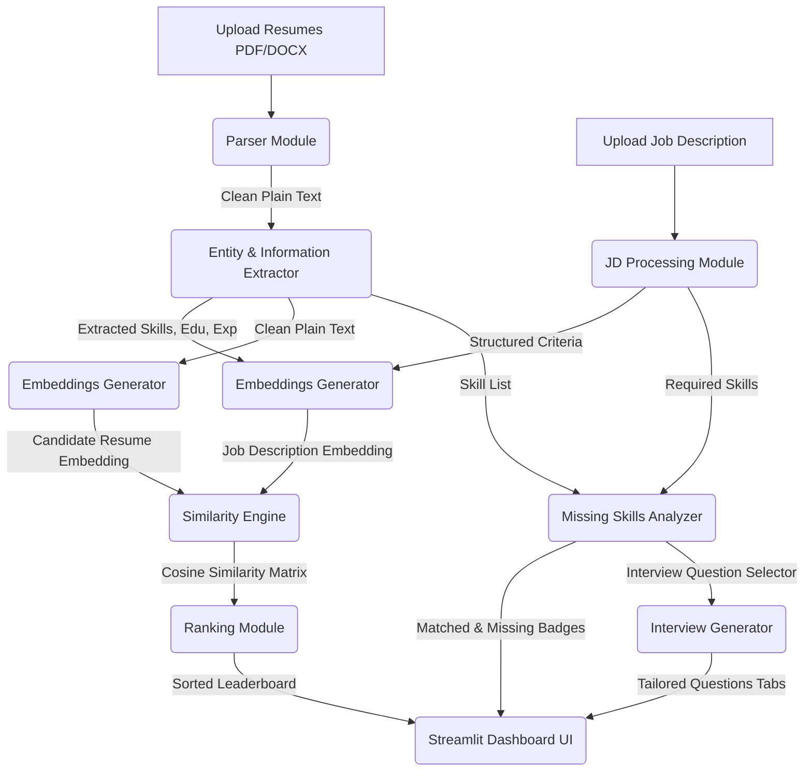

# AI Resume Screening & Candidate Ranking System

A complete, production-grade AI-powered Resume Screening and Candidate Ranking platform. The system leverages state-of-the-art Natural Language Processing (NLP) techniques, Information Extraction pipelines, and semantic vector models using **Sentence-BERT (SBERT)** to automate the parsing, analysis, ranking, and interview preparation process for recruiters.

---

## 🏗️ Architecture & Pipeline Flow

The workflow processes resume documents and job descriptions (JDs) to yield semantic alignment scores, skill gaps, and tailored interview scripts.



---

## 📁 Folder Structure

```
AI_Resume_Screener/
├── app.py                      # Main Streamlit Dashboard Application
├── requirements.txt            # Project Dependencies
├── README.md                   # Complete System Documentation & Interview Prep Guide
├── resume_parser/
│   ├── __init__.py             # Package initializer exposing main functions
│   ├── parser.py               # Handles PDF/DOCX raw text extraction and cleaning
│   └── skill_extractor.py      # Keyword and regex rule extractors (skills, edu, exp)
├── jd_processing/
│   ├── __init__.py             # Package initializer
│   └── jd_parser.py            # Extracts required/preferred skills, education, and experience from JD
├── embeddings/
│   ├── __init__.py             # Package initializer
│   └── bert_embeddings.py      # Sentence-BERT (all-MiniLM-L6-v2) embedding generator (TF-IDF fallback)
├── ranking/
│   ├── __init__.py             # Package initializer
│   ├── similarity.py           # Calculates Cosine Similarity percentages
│   └── ranking.py              # Leaderboard sorting algorithms with tie-breakers
├── interview_generator/
│   ├── __init__.py             # Package initializer
│   └── question_generator.py   # Domain question bank mapping skills to questions
└── data/
    ├── resumes/                # Directory for local sample resumes
    └── job_descriptions/       # Directory for local sample job descriptions
```

---

## 🚀 Installation & Execution

### Prerequisites
* Python 3.11 or higher
* Pip (Python Package Manager)

### Step-by-Step Setup

1. **Install Dependencies:**
   ```bash
   pip install -r requirements.txt
   ```

2. **Generate Sample Data:**
   Create mock candidate resumes and a sample Job Description:
   ```bash
   python generate_sample_data.py
   ```

3. **Run the Streamlit Dashboard:**
   ```bash
   streamlit run app.py
   ```
   This will open the dashboard in your default web browser (usually at `http://localhost:8501`).

---

## 💡 Usage Guide

1. **Step 1:** Paste or upload the **Job Description** in the sidebar panel.
2. **Step 2:** Select your preferred matching algorithm (**Sentence-BERT** for semantic concept matching or **TF-IDF** for keyword match).
3. **Step 3:** Adjust the **Minimum Match Threshold** slider (default 45%) to filter low-scoring candidates.
4. **Step 4:** Upload multiple candidate resumes in **PDF** or **DOCX** format.
5. **Step 5:** Click **🚀 Analyze & Rank Candidates** in the main area.
6. **Step 6:** Review the **Ranked Leaderboard**, and expand individual candidates to view parsed metrics, **Matched/Missing Skills badges**, and **Tailored Interview Questions**.

---

## 👨‍💻 Interview Talking Points

This section contains technical explanations of the core mechanics, designed to help you explain the project confidently during internships and placement interviews.

### 1. Resume Parsing & Text Normalization
* **How it works:** Raw file streams (PDFs and DOCXs) are read using `pdfplumber` and `python-docx`. `pdfplumber` is preferred over standard libraries like `PyPDF2` because it retains structural formatting, layouts, and reading order of columns.
* **Text Normalization:** Plain text undergoes whitespace collapse (`re.sub(r'\s+', ' ', text)`) and unicode cleanup to ensure spelling checks and regex patterns align perfectly without punctuation noise.

### 2. Information Extraction & Rule-based NLP
* **Technical Skill Extraction:** We utilize a precompiled database of technologies (standardized mappings) with regex-based boundary boundaries (`\b`). To avoid false positives on short terms like "Go" or "R", we implement **case-sensitive token isolation** for those specific languages, while mapping aliases like `golang` case-insensitively.
* **Highest Education Extraction:** Education level is determined using an ordered hierarchy from **Ph.D. -> Master's -> Bachelor's -> Diploma**. The extractor matches regex variations and assigns the candidate the highest tier found.
* **Years of Experience Calculation:** Experience is extracted using a dual-heuristic strategy:
  1. **Pattern Matching:** It scans for declarations like `"X+ years of experience"`.
  2. **Timeline Calculation:** It extracts active dates (e.g. `2018 - 2023`, `2021 - Present`), computes the year differences, and sums them. The local time is anchored using current metadata.

### 3. Sentence-BERT (SBERT) Semantic Embeddings
* **Background:** Standard BERT generates word-level representations. Using word vectors to compare sentences requires pooling (e.g., averaging), which yields poor semantic vectors. **Sentence-BERT (SBERT)** uses a Siamese network structure to fine-tune BERT on sentence pairs, producing high-quality sentence embeddings.
* **Model Choice:** We use `all-MiniLM-L6-v2`. It maps texts to a 384-dimensional dense vector space. It is chosen because it is highly optimized (runs rapidly on CPU without requiring GPUs) while retaining 99% performance of larger models.
* **Caching:** We utilize Streamlit's `@st.cache_resource` decorator to load the model once and keep it in memory across application cycles.

### 4. Cosine Similarity & TF-IDF Fallback
* **Cosine Similarity:** We calculate the cosine of the angle between the Job Description vector ($A$) and the Resume vector ($B$):
  $$\text{Similarity}(A, B) = \frac{A \cdot B}{\|A\| \|B\|}$$
  This isolates the orientation rather than length, making it length-invariant (longer resumes don't artificially score higher).
* **TF-IDF Fallback:** If Sentence-BERT cannot be loaded (offline environment or memory restrictions), the system dynamically initializes Scikit-Learn's `TfidfVectorizer`. It fits on the combined corpus of the JD and all resumes, creating sparse n-gram frequency matrices, and computes cosine similarity across the sparse matrices.

### 5. Information Retrieval & Candidate Ranking
* **Tie-Breaker Mechanism:** In standard recruiters' dashboards, candidates frequently tie on similarity score. To handle this, the system sorts candidates using a tuple key: `(similarity_score, len(matched_skills))`. Thus, for identical semantic overlaps, the candidate possessing a higher volume of exact required keywords is ranked higher.

### 6. Scalability & Production Readiness
* **Batch Processing:** Instead of encoding each resume individually in a loop (which incurs multiple PyTorch execution overheads), we aggregate texts into a single batch `[JD] + [Resumes...]` and execute a single parallel model call (`model.encode(texts)`).
* **Memory Management:** Processing very large text blocks can cause memory bloat. Text is truncated, and generator functions are used during file reading to keep memory footprint minimal.

---

## 🔮 Future Improvements
* **Spacy NER Custom Model:** Train a Custom Named Entity Recognition (NER) model using spaCy to isolate job roles and candidate names dynamically without predefined lists.
* **RAG Interview Assistant:** Connect the extracted resume to an LLM (e.g., Llama-3 or GPT-4) via LangChain to dynamically formulate custom, non-canned interview questions matching exact candidate projects.
* **Resume Parse Visualization:** Display parsed text segments directly in side-by-side highlights.
